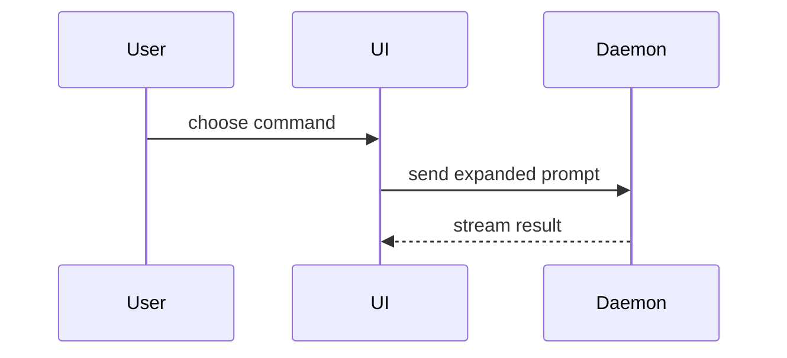

# Diagram Studio

Produce professional diagrams as Excalidraw through conversational design or autonomous generation. Act as a visual design consultant: help the user figure out what kind of diagram actually fits their need, then produce a polished, ready-to-open result. Excalidraw files are JSON with a well-defined element schema (rectangles, ellipses, diamonds, arrows, lines, text, frames).

## Two execution paths

Resolve the target before designing anything:

- **MCP path (primary)** — an Excalidraw MCP server is connected. Work on a live canvas and save when done.
- **File path (fallback)** — no MCP. Generate standalone `.excalidraw` files with the bundled scripts.

Never mix paths in one diagram.

## MCP path

Call `excalidraw_read_diagram_guide` **before** creating anything — it carries the color palette, sizing rules, layout patterns, and anti-patterns for professional results.

| Step | Tool | Notes |
|---|---|---|
| Build the diagram | `excalidraw_batch_create_elements` | Assign custom `id` to shapes; bind arrows with `startElementId`/`endElementId` so Excalidraw auto-routes them to shape edges |
| Standard flowchart/sequence with existing Mermaid | `excalidraw_create_from_mermaid` | Fastest path when the user already has Mermaid or the structure is conventional |
| Iterate | `excalidraw_update_element`, `excalidraw_delete_element`, `excalidraw_query_elements` | Query by type/filter/bbox to find element ids |
| Save | `excalidraw_export_scene` | Writes `.excalidraw` (or `.excalidraw.md` for Obsidian) |
| Share | `excalidraw_export_to_excalidraw_url` | Encrypted upload; returns a view link |

## File path (no MCP)

```bash
python3 scripts/generate_excalidraw.py <spec.json> -o diagram.excalidraw   # spec JSON -> auto-laid-out .excalidraw
python3 scripts/validate_excalidraw.py diagram.excalidraw                  # structural validation
```

The spec JSON schema and layout options are documented in `references/excalidraw-schema.md`.

## Explain mode (lightweight explanation views)

When the goal is for the user to *understand the current topic* — not to produce a kept diagram artifact — skip Excalidraw and reply inline with the smallest view that makes the point. No preamble, prose kept brief.

**Decision rule:** structure to explain → diagram or sketch inline; interactivity, dense layout comparison, or a visual UI concept → focused HTML artifact. Only use the Excalidraw paths above when the user wants a persistent, editable, or presentable diagram.

Inline options, smallest first:

- **Logic / algorithm** → pseudocode:

```text
on(save)
  if content is unchanged
    return cached result
  write new content
  return fresh result
```

- **Runtime control flow** → call tree:

```text
submitForm
  createSession
    persistPrompt
    launchAgent
  navigateToSession
```

- **UI structure** → component tree with state and module boundaries that matter:

```tsx
<SessionPage> (apps/example/src/routes/session.tsx)
  useSessionEvents()
  <SessionToolbar>
    <RunSkillButton> (packages/ui)
```

- **File responsibility / broad refactor** → shallow file tree:

```text
src/
├── commands/       # parses user actions
├── sessions/       # owns session state
└── transport/      # sends API requests
```

- **Interaction or data flow** → Mermaid (sequence, flow, state):



- **"What changes"** → `diff`, matching the diff shape to the topic (component tree for a component change, file tree for a layout change, call tree for a control-flow change, pseudocode for a logic change).
- **Copyable target shape or mostly-new block** → the whole code block, only the calls, files, props, states, and boundaries needed for the current question.
- **Dense concept, layout comparison, or visual UI** → one focused HTML file — diagram, infographic, or short slide deck. Match the product's colors, type, and spacing; use real labels and data; support desktop and mobile. Then open it (`open path/to/<slug>.html`).

Place each visual next to the short text it supports. Use one or several; never all — don't overwhelm. You may combine this with diagram-types.md fit selection: if the explanation view turns out to be worth keeping, promote it to a real Excalidraw diagram.

## Modes

Resolve from the request, not the user's expertise:

1. **Guided (default)** — the user has a rough idea, not a spec. **MANDATORY — READ `references/guided-design.md`** first, then facilitate: what is being communicated, to whom, which type fits, what the key nodes and flows are. Then generate.
2. **Autonomous** — the user supplies a complete description or spec. **MANDATORY — READ `references/diagram-generation.md`** before generating; report the result and offer one adjustment pass.
3. **Quick** — "just make it". Infer everything with sensible defaults, generate, offer one adjustment pass.

**MANDATORY — READ `references/diagram-types.md`** — which type fits which need: (flowchart, architecture, sequence, mind map, state, ER, and when each is wrong). Generation mechanics and layout rules: `references/diagram-generation.md`. Element-level schema details: `references/excalidraw-schema.md`.

## Workflow

1. Resolve mode and execution path.
2. **MANDATORY — READ `references/diagram-types.md`** if the fit isn't obvious.
3. Draft the structure as a node/edge list — content before coordinates.
4. Execute via the resolved path. On the MCP path, load the diagram guide first; on the file path, run the validator before presenting.
5. Present: saved file path or canvas state. Offer iteration — add, reroute, restyle, or restructure.

## NEVER

- **NEVER claim a diagram looks right without verifying the rendered result**
  **Instead:** query the canvas elements (`excalidraw_query_elements`) or validate the file (`validate_excalidraw.py`), and say what was checked.
  **Why:** coordinates and arrow bindings fail silently; unverified output is often overlapping soup.

- **NEVER hand-place every coordinate freehand**
  **Instead:** use arrow `startElementId`/`endElementId` binding on the MCP path, or the auto-layout generator on the file path.
  **Why:** manually computed positions drift and overlap; binding and auto-layout keep structure consistent while you iterate.

- **NEVER switch execution paths mid-diagram**
  **Instead:** pick MCP or file path at the start and finish there.
  **Why:** element ids and canvas state don't transfer; mixing loses work.

## Pairs with

- `architecture-spine` — turn a settled architecture spine into a diagram of the boundaries and invariants.
- `product-design-init` — wireframe and flow sketches during the design-standards work.

